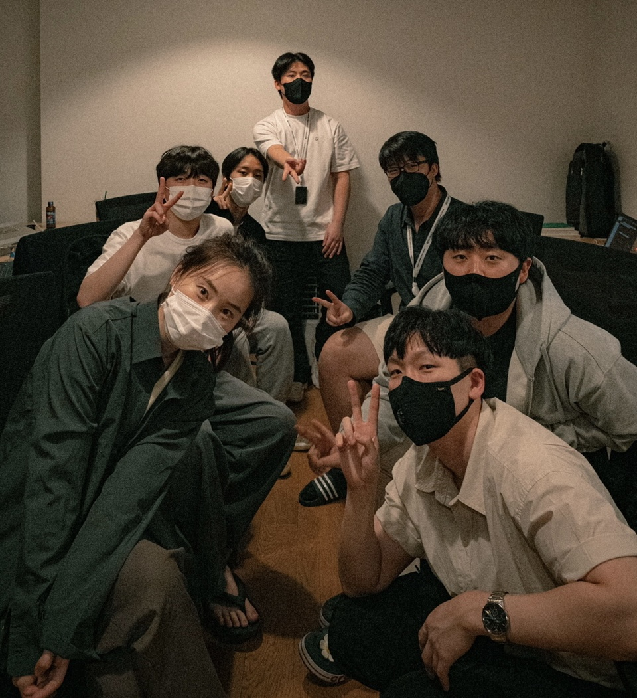

## 2차 project 회고

**2차 project : 2022.8.29 - 2022.9.8 위앤비팀**

## 프로젝트 시작

2차 프로젝트가 시작되었다. 1차 프로젝트때의 아쉬웠던 점 (웹사이트의 기능이 부족했다..!) 미비했던 점(팀원간의 소통이 부족했다..!)을 보완하면서 기능적으로 완성된 웹사이트를 만들고 싶었다.
우리가 클론할 웹 사이트는 에어비앤비였고 위 사이트는 유저페이지와 호스트 페이지가 나뉘어져 있어 1차보다 기능적으로 구현해야 할 사항들이 많았다.
프론트4명, 백엔드3명 총 7명의 위앤비 팀원과 함께 프로젝트를 시작하였다.

## 기획

첫날은 먼저 플로우 차트를 그려보았다. 구현해야 할 사항과, 추가 구현으로 할 사항을 나누고 백엔드분들이 어떤 형식으로 데이터를 주실지, 어떤 식으로 구현할지
차트를 그려보고 그때그때 궁금한 사항이나 확인해야 할 사항을 모두 확인하였다.
첫날 백엔드 근우님께서 플로우차트를 그리는 것을 제시하고 주도적으로 이끌어 주었는데, 이때 작성했던 플로우 차트가 막히는 것 없이 사이트 구현에만 집중할 수 있게 한 큰 힘이 되었다.
결론적으로 우리는 유저 페이지와 호스트 페이지를 모두 구현하는 것으로 목표를 잡았고, 카카오 로그인, 무한스크롤, 무한슬라이드, 달력, 지도, 예약 으로 백엔드 3명, 프론트4명이 하기에는
10일이라는 다소 짧은 기간에 벅찰 수 있지만 할 수 있는 데까지 해보자며 도전을 하였다.

### 1주차

플로우 차트를 그린 후 역할 분담을 하였다. 나는 main페이지와 사이트내 공통으로 들어갈 슬라이드 footer를 구현하기로 했다.
메인 페이지의 경우 데이터를 통신으로 받아온 후 map 함수로 뿌려주는데 에어비앤비의 경우에는 위도,경도를 받은 데이터로 km 를 UI에 넣어 구현해야 했기에
선릉역을 기준으로 km를 구하는 함수를 따로 작성해야 했다. 또 에어비앤비에 각 숙소정보에 들어갈 여러장의 사진을 무한 슬라이드로 구현하고, 사이트 내 무한 스크롤을 구현하는 것이
메인 페이지의 주요 기능이었다. 옵션으로 슬라이드 푸터도..!
다행이도 2일차에 API 명세서를 받아볼 수 있었고 어떤 형식으로 데이터를 받을지, key값은 뭔지? 미리 알수 있었기에 mock data를 그대로 짜고 코드를 짜는 것이 수월했다.
생각보다 빠른 시간내에 UI 구현이 완료되었고 다행히 통신도 비교적 원활하게 마무리 되었다..! 다만, 이번 프로젝트의 과제가 있다면 css부분을 style component로 구현해야 하는 것이었는데 처음 사용해보는거라 다소 생소하기도 했고, 매번 이름을 지어주는것도 꽤나 고심하는 시간이 필요했다.

### 2주차

2주차에는 git rebase라는 것을 하였는데(이것도 과제..) 문제가 이 rebase의 경우 충돌이 쉽게 일어날 수가 있고 만약 너무 꼬여버려서 되돌리지 못할 경우엔 새롭게 클론을 하고 다시 새로운 branch를 만들어 pr을 다시 작성하고 멘토님의 리뷰도 다시 받아야 한다고 했다. 그런데... 내가 그렇게 될줄은 몰랐다...! 처음 해보는 git rebase가 꼬여버려서 시간을 많이 소요하였고 결론적으로 새로 clone을 하여 작업을 다시 해야 했다. 원활하게 가고 있다 생각했는데 예상치 못하게 시간이 여유롭지 못한 상황에서 2주차에 다시 클론을 해야하는 상황이 생기자 살짝 멘탈이 흔들릴뻔 했지만 좋은 팀원분들 덕분에 (git rebase 꼬인 것을 많이 도와주시려고 했다 정말로 무한 감사..)UI 작업과 통신까지 잘 마무리 할 수 있었다.
프로젝트 마지막 쯔음에 모두 작업한 것을 최종적으로 merge 했을때 css 가 깨지고 갑자기 잘 되던 통신이 안되는 부분도 있었지만 팀원 한명이 모두 전담하여 이끄는 것이 아니라, 로테이션으로 깨지는 부분들을 해결하고 의논했던 부분도 팀원분들의 배려가 느껴져서 감사했다.

<iframe width="560" height="315" src="https://www.youtube.com/embed/4i2Bv78AlmY" title="YouTube video player" frameborder="0" allow="accelerometer; autoplay; clipboard-write; encrypted-media; gyroscope; picture-in-picture" allowfullscreen></iframe>

### 결과

기획헸던 바대로 메인페이지 무한스크롤 슬라이드 푸터 사진 무한 슬라이드 호스트페이지 예약기능 캘린더 달력 지도 모두 구현할 수 있었다. 프로젝트 시연때도 영상이 아닌 실제 구현한 사이트를 그대로 소개할 정도로 통신도 원활했다.

### 마지막 회고

2차 프로젝트는 좀 더 많은 기능들을 구현할 수 있어 좋았고, git rebase가 꼬이지 않았다면 좀 더 많은 부분들을 구현했을텐데 그러지 못한 점이 아쉬웠다. 프로젝트는 기획한대로 흘러간 적이 없는 것 같다. 하지만 그런 상황에 좋은 팀원분들이 있어 끝까지 잘 마무리 할 수 있었고, 개발을 공부할수록 개발자가 되는 것이 얼마나 어려운 일인지, 또 얼마나 공부해야할 것이 많고 내가 부족한 것이 많은지 역설적으로 더 깨닫게 되는 것 같다. 그래도 코딩하는건 정말 재밌고 잘하고 싶다. 프론트엔드 개발자가 정말 되고 싶다. 이렇게 2차 프로젝트도 마무리!
