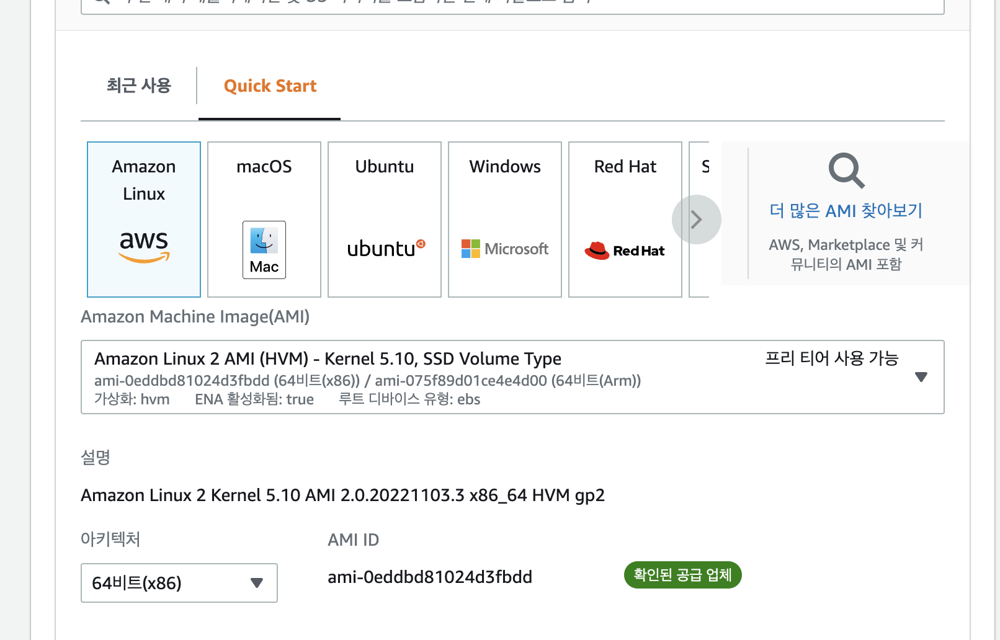
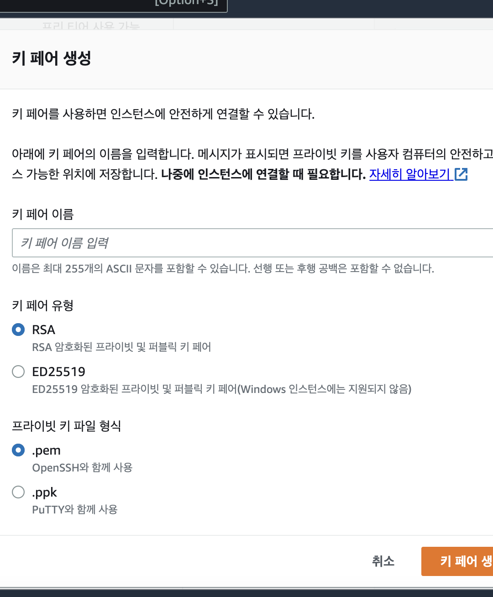
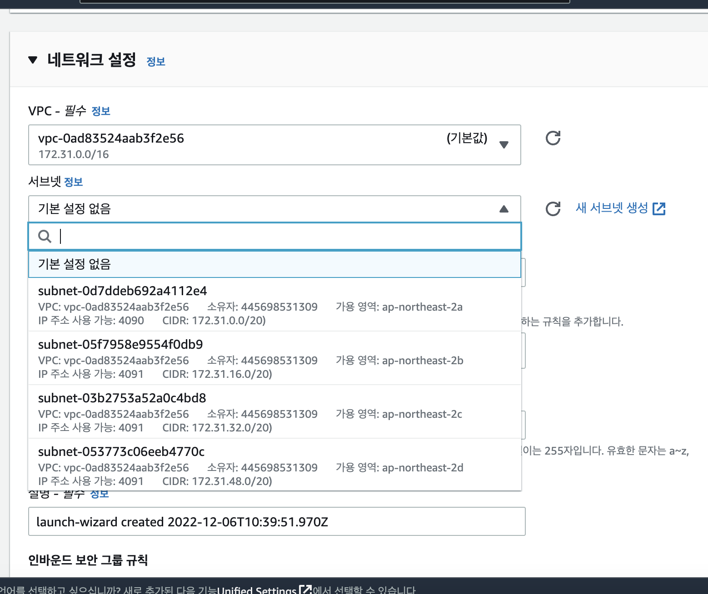
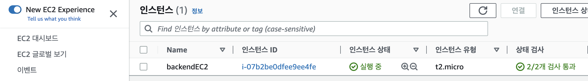
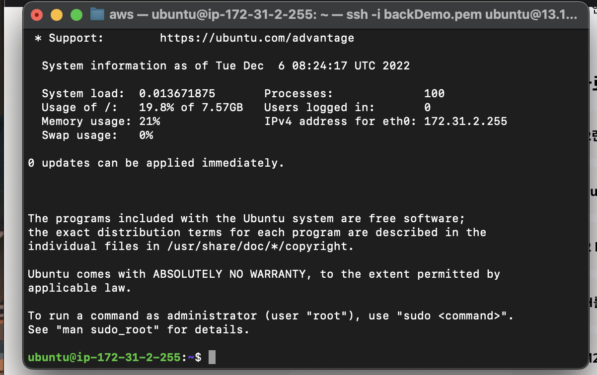

## AWS EC2 생성하여 서버 배포하는 방법
개인 프로젝트를 진행하면서 실제 서비스는 어떻게 구동되는지 궁금했고, 직접 프론트엔드부터 백엔드까지 구현해보기로 마음먹었다. 
아래는 백엔드 서버를 AWS EC2를 통해 배포하는 방법에 대해 간략히 설명하겠다. 
<br>

### AWS-EC2 선택 이유
실제 서버를 배포할 서비스를 찾고있던 중 무료 이용이 가능한 히로쿠 서버가 22년 11월부터 유료로 전환된다고 하여 다른 서비스를 찾게 되었다.
같은 부트캠프 출신 백엔드 개발자가 이 서비스를 추천해주었는데, 관련해서 정보를 찾아보니 아래와 같은 특징이 있었다.
#### AWS-EC2 특징
> AWS-EC2 
를 사용하면 On-demand로 원하는 시간에 원하는 사양의 가상 서버를 신속하게 만들어서 매우 유연하게 사용할 수 있다. EC2를 사용하면 단순히 가상 컴퓨터를 대여받아 빠른 제품 출시와 비용 절감을 할 수 있어 나와 같은 FE 개발자가 사용하기에 접근성 및 비용절감 측면에서 용이했다.

<br>

###  EC2 Instance 생성하기 



EC2 Instances 페이지로 이동 후 Launch Instances 을 클릭하여 EC2 Instance의 이름을 작성하고 Ubuntu를 선택 하였다.

<br>


`Instance Type` 은 t2.micro를 선택하고 새키페어생성을 눌러 아래와 같이 선택 후 원하는 키 페어 이름을 입력한다.
<br>

네트워크 편집 버튼을 누른 후 위와 같이 설정해 주고 퍼블릭IP는 활성화를 선택해준다.


이후 Launch Instance 를 클릭하여 EC2 Instance 를 실행해주었을때 위와 같이 인스턴스 상태에 실행중이라고 뜬다면 성공이다.

### SSH를 이용한 EC2 Instance 접속
먼저 pem 파일이 위치한 디렉토리로 이동한다.

```javascript
// EC2 Instance Type이 Ubuntu인 경우
ssh -i 파일명.pem ubuntu@EC2-PublicIP

//EC2 Instance Type이 Linux인 경우
ssh -i 파일명.pem ec2-user@EC2-PublicIP
```
실행하겠냐는 문구가 나오면 yes를 입력한다. 그러면  pem 파일의 권한 0644는 너무 많이 오픈되어있다. 라는 경고 문구가 나오는데 다음과 같은 명령어를 입력하여 권한을 수정해야 한다.

```javascript
chmod 400 파일명.pem
```
다시 pem 파일이 위치한 디렉토리로 이동하여 실행해주면 아래와 같이 정상적으로나온다.




## Ubuntu  Node.js 설치및 npm 환경구축 
노드를 설치하기에 앞서 설치에 필요한 커맨드라인툴을 설치해야 한다. 아래 명령어를 입력하여 우분투에 `CURL`를 설치한다.

```javascript
sudo apt-get install -y curl
```

아래 명령어를 순서대로 입력하여 api패키지 매니저를 이용해 `node.js` 를 먼저 다운 받은 후 `npm`를 다운 받는다.
```javascript
sudo apt update
```
```javascript
sudo apt install nodejs
```
```javascript
sudo apt install npm
```
위 명령어로 `npm` 환경을 구축한 후 후에 `git clone` 으로 해당 서버 API를 다운받은 후 `npm i` 하고 `npm start`하면 프론트엔드도 성공적으로 서버를 배포할 수 있다. 