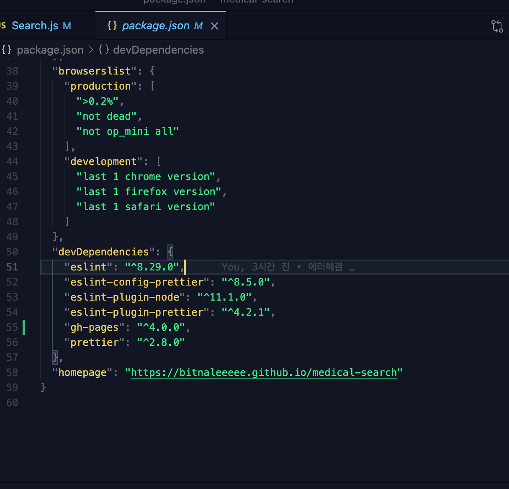

## 리액트 프로젝트를 gh-pages 배포하는 방법
<br>

GitHub 레포지토리에 작성한 코드를 무료로 배포하는 방법을 알아보겠다.

<br>

### gh-pages 설치하기
먼저 아래 명령어로 설치를 해준다

```
npm install gh-pages --save-dev
```

### package.json 파일 수정하기
<br>

package.json 파일에 아래와 같이 코드와 배포할 홈페이지 주소를 추가해준다.


```
    "predeploy": "npm run build",
    "deploy": "gh-pages -d build"
```



### 배포하기
```
npm run deploy
```

배포 명령어를 입력 후 해당 github - settings - pages를 들어가면 gh-pages 브랜치가 새로 생긴다. 


위와 같이 Source 의 branch를 gh-pages로 위와 같이 설정해주면 무료로 웹 호스팅을 할 수 있다.
