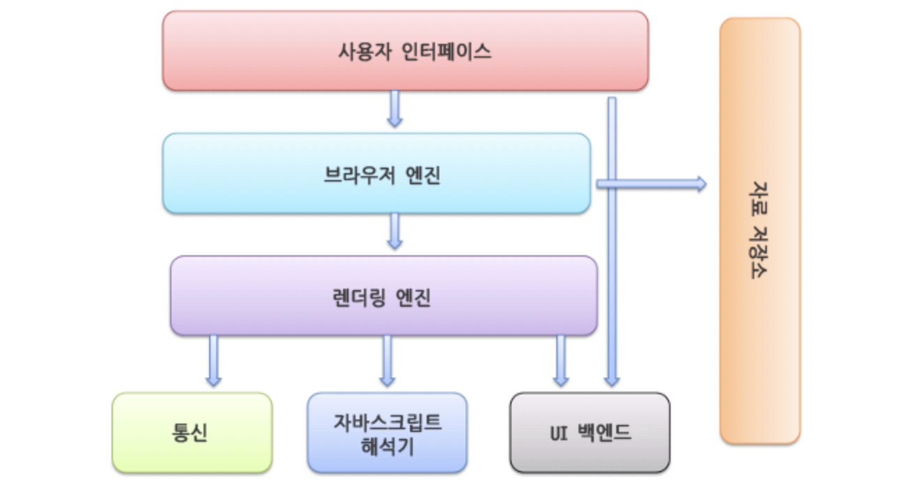
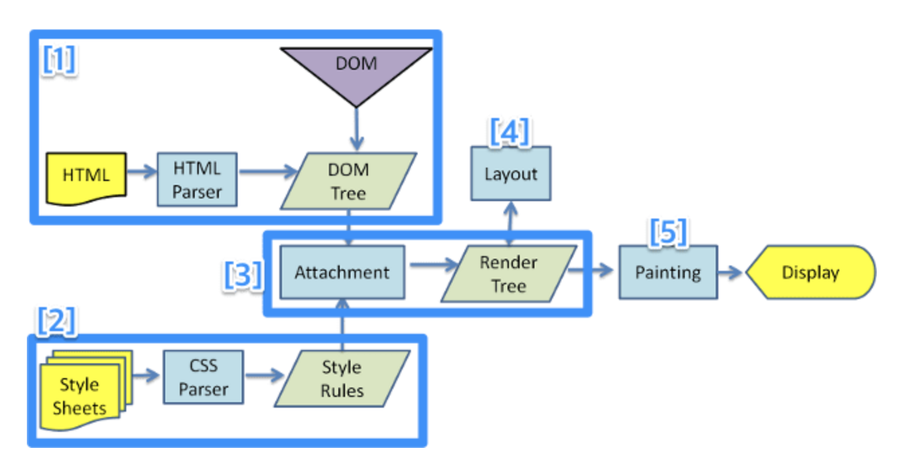

## 브라우저(broswer)

웹 페이지를 다운 받아 렌더링 하고 이를 사용자에게 보여주는 프로그램.
우리가 사용하는 가장 복잡한 응용 프로그램 중 하나라고 할 수 있다.
웹 페이지는 html, css, js로 구성되어 있으며 브라우저는 이를 실행해주는 엔진이다.

### 브라우저의 기본 구조

1. 사용자 인터페이스 - 주소 표시줄, 이전/다음 버튼, 북마크 메뉴 등 요청한 페이지를 보여주는 창을 제외한 나머지 모든 부분이다.
2. 브라우저 엔진 - 사용자 인터페이스와 <-> 렌더링 엔진 사이의 동작을 제어한다.
3. 렌더링 엔진 - 요청받은 내용을 브라우저 화면에 표시한다.
4. 통신 - HTTP 요청과 같은 네트워크 호출에 사용됨. 이것은 플랫폼 독립적인 인터페이스이고 각 플랫폼 하부에서 실행됨.
5. UI 백엔드 - 콤보 박스와 창 같은 기본적인 장치를 그림 플랫폼에서 명시하지 않은 일반적인 인터페이스로서 OS 사용자 인터페이스 체계를 사용.
6. 자바스크립트 해석기 - 자바스크립트를 해석하고 실행.
7. 자료 저장소 - 자료를 저장하는 계층, 쿠키를 저장하는 것과 같이 모든 종류의 자원을 하드 디스크에 저장할 필요가 있다.

<!-- 웹은 어떻게 작동할까?
user - brower - website
    enters a URl
     DNS Server
      Server -->

## 렌더링 엔진

요청한 콘텐츠를 표시하는 역할을 한다.
safari는 webkit
firefox는 gecko
chrome은 blink 엔진을 사용하며, 모든 렌더링 엔진은 기본적으로 웹표준을 준수한다.

### 렌더링 엔진의 목표

1. 웹 페이지에 포함된 모든 요소(html, css, js, img 등)들을 화면에 보여준다
2. 업데이트가 필요할때 효율적으로 렌더링할 수 있도록 자료 구조를 생성한다. 업데이트 예시:사용자 동작으로 인한 입력, 스크롤, 애니메이션동작, 비동기요청으로 인한 데이터로딩 등.

## critical rendering path(CRP)

1. html - dom 트리(위에서 아래로)
2. css - cssom 트리(위에서 아래로) ex. body태그에 text-align을 정해준다면, 자식 요소에도 동일하게 적용됨
3. 렌더트리(render tree): dom tree + cssom tree
   화면에 표시되어야 할 모든 노드의 컨텐츠, 스타일 정보를 포함하는 트리.
   document부터 각 노드를 순회하면서 각각에 맞는 cssom을 찾아 규칙을 적용한다.
   간단히 말해 dom 트리와 cssom 트리를 합해놓은 것이다.
   이때 렌더에 포함되지 않는 meta 태그나 Display none등은 포함되지 않는다.
4. reflow(layout): 정확한위치, 크기 계산
5. paint: 마지막으로 실제 픽셀로 그려지도록 변환한다. 텍스트, 이미지들이 실제 픽셀로 그려진다.

### 브라우저 렌더링 최적화

사용자 동작으로 css가 변경되거나 애니메이션 재생이 일어났을땐?

브라우저 렌더링의 프로세스는 아래와 같다.

1. 다시 layout이 발생하는 경우 - 주로 요소의 크기나 위치가 바뀌었을때,
   혹은 브라우저 창의 크기가 바뀌었을때 다시 발생. 레이아웃 > 페인트 > 레이아웃 합성의 과정을 거친다.
2. paint부터 다시 발생되는 경우
   주로 배경 이미지나 텍스트 색상, 그림자등 레이아웃의 수치를 변화시키지 않는 스타일의 변경이 일어났을때 발생.
   paint 단계에서는 여러 layer를 나눠 픽셀을 채워넣는 작업을 한다. 한번에 처리하지 않고 특수한 알고리즘에 따라 layer를 나눠 처리하는데, 이는 사용자 이벤트 발생으로 특정 요소를 수정해야 할 때, 전체를 다시 paint하지 않고 특정 layer만을 다시 페인트하여 효율적으로 처리할 수 있는 이점을 가진다.
3. 레이어의 합성(composite)만 발생하는 경우
   성능상으로 가장 큰 이점을 가짐. paint 단계에서 여러 layer로 나눠진 raster 픽셀들을 우리가 실제로 보는 화면처럼 합성해주는 단계이다.
   레이아웃과 페인트를 수행하지 않고 레이어의 합성만 발생하기 때문에 성능상으로 가장 큰 이점을 가진다.

위 그림처럼 모든 JS> style > layout > paint > composite 의 모든 과정을 거칠 필요 없이 필요한 단계부터 실행하여 렌더링 속도를 높일 수 있다. 어떤 경우에 어떤 상태부터 업데이트가 되는지 확인하고 싶다면, 하기 사이트에서 확인이 가능하다.
css triggers - (https://csstriggers.com)
한 예시로 위 사이트에서 blink 엔진에서는 3가지(layout, paint, composite) 모두 일어남을 확인할 수 있다.

> 참고
> [CSS트리거](https//csstriggers.com)
> [NAVERD2](https://d2.naver.com/helloworld/59361)
