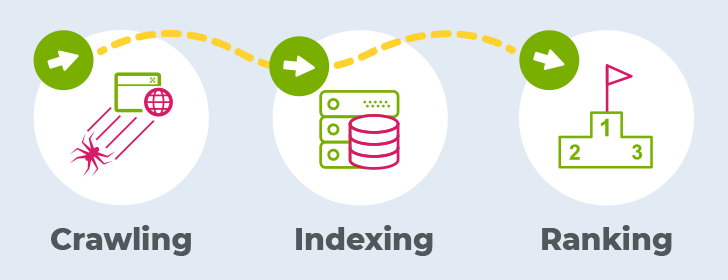

## img 태그와 background-image

img 태그는 HTML 페이지에 이미지를 삽입하는 데 사용되는 태그이며, background-image는 요소의 배경 이미지를 한 개나 여러 개 지정할 수 있는 CSS의 속성이다.
위와 같이 img 태그와 background-image 속성은 웹상에서 동일하게 구현할 수 있다. 그렇다면 이 둘의 차이점은 없는 것일까? 어떠한 때에 어떠한 코드를 쓰는것이 적절할까?

## 시맨틱 웹(Semantic Web)

1. 시맨틱 웹은 의미론적인(Semantic) 웹이라는 뜻으로 컴퓨터가 이해할 수 있는 의미있는 코드를 작성하고 이를 컴퓨터가 처리하도록 하는 프레임워크이자 기술이다.
2. 즉 웹에 존재하는 수많은 웹페이지들에 메타데이터를 부여하여, 기존의 자연어와 메타데이터 집합이었던 웹페이지를 의미와 관련성을 가지는 거대한 데이터베이스로 구축하고자 하는 발상이라 할 수 있다.
3. 메타데이터: 데이터에 대한 데이터. 대표적 예시로 HTML 태그를 들 수 있다. 아래는 HTML5에서 새롭게 추가된 시맨틱 태그이다.
   HTML5 new tag: header, nav, aside, section, article, footer
   상기 태그 모두 content의 의미를 명확히 설명하고 있는 시맨틱 요소라 할 수 있다.

## 시맨틱 태그(Semantic Tag)

위와 같이 시맨틱 태그란 의미가 있는 태그를 말한다. div와 span와 같이 의미가 없는 non-semantic tag 라 할 수 있고, form, table, article 등 내용을 명확히 정의하는 태그를 semantic(의미있는) tag 라 할 수 있다. 시맨틱 태그로 구성하여 만든 시맨틱 웹의 가장 큰 장점은 검색 엔진에서 쉽게 웹문서의 내용을 노출할 수 있게 해준다는 것이다.

## 검색엔진최적화(SEO)

검색엔진 최적화란 네이버 구글 등 검색 엔진에서 검색을 할때 가시성을 높이기 위해 사이트를 개선하는 프로세스를 말한다.

1. 크롤링(crawling): 키워드를 검색하였을때 검색 엔진에서 제일 먼저 거치는 작업으로 웹 크롤러를 이용하여 웹 페이지의 데이터를 가지고 온다. 크롤러는 DOM 형식의 웹 페이지를 볼 수 있어 그 안에 텍스트를 읽을 수는 있으나 이미지는 읽을 수 없다. 그러므로
   SEO를 위해 이미지를 인식시키기 위하여 img 태그 삽입시 alt txt 태그를 달아주는 것이 좋다. 크롤러는 여러 링크를 넘나들며 웹 페이지에 관한 데이터를 검색 엔진 서버로 가져온다.

2. 인덱싱(indexing): 크롤러가 가져온 데이터를 브라우저와 같은 방식으로 렌더링하여 그에 따라 페이지의 모든 콘텐츠와 메타 데이터를 분류하여 저장하는 작업이다. 수집한 모든 단어의 항목에 맞추어 각 페이지의 위치를 색인하고 데이터 베이스를 구성한다. 검색 엔진은 인덱싱을 통해 저장한 정보로 웹 페지이를 평가하며 웹사이트에 노출시킨다(ranking). 사용자가 검색하는 키워드와 색인 내 가장 많이 일치하는 페이지가 상위 노출된다. 특히 검색엔진은 태그를 기반으로 페이지 내 검색 키워드의 우선순위를 판단하므로, 코드 작성시 시맨틱 태그를 사용하여 검색 순위를 높일 수 있다.

### img 태그 사용

1. 디자인 요소뿐 아니라 콘텐츠와 관련된 이미지의 경우 img 태그를 사용하여 색인을 생성하고, alt txt를 입력해주어 웹사이트가 검색 결과에 더 잘 보이도록 할 수 있다.좋은 SEO의 경우 광고보다 마케팅적으로 더욱 효율적이므로, 경쟁업체의 웹 사이트보다 더 높은 가시성과 검색 결과는 수익에 중대한 영향을 미칠 수 있다.
2. 시각 장애인들은 웹 사이트 사용을 스크린 리더기에 의존을 하게 되는데, img 태그의 대체 텍스트(alt)는 스크린 리더기에 식별이 가능하기 때문에 웹 접근성을 더욱 높일 수 있다. \*스크린 리더기: 웹 사이트 내용을 읽어주는 기계 혹은 기능

### background-image 사용

1. 콘텐츠의 직접적인 관련이 없는 순전히 디자인적 요소를 위해 사용하는 경우에 적절하다.
2. 반복 이미지일 경우(ex.블로그 아이콘)에 쓰는 것이 좋다.

즉 이미지가 컨텐츠와 직접적인 관련성이 있을 경우 img 태그를 사용하고 이때 alt 속성을 활용하여 웬 접근성을 높여주는 것이 좋은 seo라 할 수 있으며,이 외에 단지 디자인적 목적이라면 background image속성을 사용하는 것이 바람직하다고 할 수 있다.

###

> 참고
> [MDN](https://developer.mozilla.org/ko/docs/Glossary/SEO) > [keywordhero](https://searchengineland.com/guide/what-is-seo)
